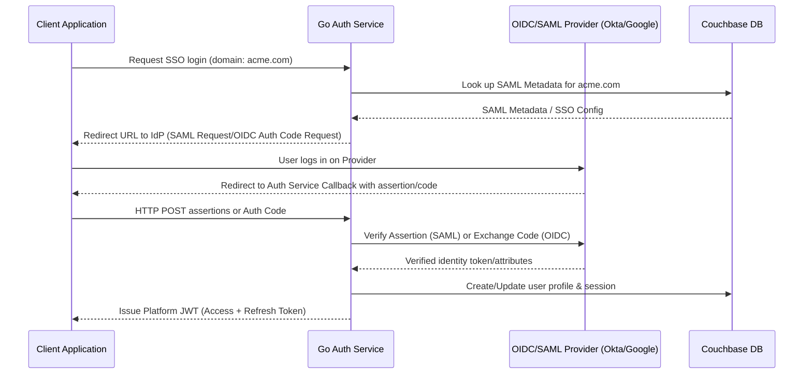

# Couchbase Developer Platform (Couchbase-Supabase)
## Functional Specification

This document details how developers and client applications will interact with the Couchbase Developer Platform. It outlines the developer workflow, SDK usage patterns, and user experience.

---

## 1. Target Personas

* **Platform Developer**: Builds, deploys, and configures backend services, schemas, and security rules.
* **Client App Developer**: Integrates the frontend or mobile application with the platform using the Client SDK.
* **End-User**: Authenticates and interacts with the final application powered by our platform.

---

## 2. Developer Experience (DX)

Developers manage their platform projects using two main interfaces: the **Command Line Interface (CLI)** and the **Web Console (Dashboard)**.

### A. The Developer CLI (`cb-cli`)
The CLI is used for local development, schema migrations, and deployment.

* **Initialize a New Project**:
  ```bash
  cb-cli init my-project
  ```
  *Creates a directory structure with configuration files (auth policies, database configurations).*

* **Run Platform Locally (Docker Compose)**:
  ```bash
  cb-cli start
  ```
  *Spins up the Couchbase Server, Gateway, Auth, Realtime, and Storage services locally.*

* **Deploy Local Configuration to Production**:
  ```bash
  cb-cli deploy --project-ref staging
  ```
  *Deploys database scopes/collections, authentication configurations, and security policies.*

---

### B. The Web Console (Dashboard)
A modern, web-based control panel that provides:
1. **Database Explorer**: Visual table-editor interface to view, edit, search, and delete documents within Couchbase scopes and collections.
2. **Authentication Settings**:
   - Manage registered users.
   - Configure OIDC providers (Google, Apple, GitHub) and SAML integrations.
   - Manage JWT lifetime and sign-out policies.
3. **Storage Manager**: Create storage buckets (e.g., "avatars", "invoices") and visually manage uploaded media files.
4. **Logs & Monitoring**: Realtime API request logs, WebSocket connections count, and database resource usage.

---

## 3. End-User / Client SDK Experience

Client apps communicate with the platform via the **Couchbase Client SDK** (available for JavaScript/TypeScript, Swift, Kotlin, and Flutter). The SDK mirrors the Supabase syntax but targets Couchbase scopes and collections.

### A. Initialization
```javascript
import { createClient } from '@couchbase-platform/supabase-like'

// Initialize client with project URL and anonymous public API key
const cb = createClient('https://your-project.cbplatform.co', 'your-anon-key')
```

---

### B. Authentication Workflow (with OIDC/SAML)

* **Email & Password Sign Up**:
  ```javascript
  const { user, error } = await cb.auth.signUp({
    email: 'user@example.com',
    password: 'secure-password-123'
  })
```

* **OAuth/OIDC Sign In (e.g., Google or Azure AD)**:
  ```javascript
  const { data, error } = await cb.auth.signInWithOAuth({
    provider: 'google',
    options: {
      redirectTo: 'https://myapp.com/welcome'
    }
  })
  ```

* **SAML Single Sign-On (SSO)**:
  ```javascript
  // Triggers enterprise SAML flow using a configured identity provider slug or email domain
  const { data, error } = await cb.auth.signInWithSSO({
    domain: 'enterprise-company.com'
  })
  ```

---

### C. Database CRUD Operations
The SDK maps methods to HTTP REST API calls handled by the Data API Service. It automatically attaches the active session's JWT to authorize requests.

* **Select Documents with Filtering**:
  ```javascript
  const { data, error } = await cb
    .from('profiles') // Couchbase collection
    .select('username, avatar_url')
    .eq('active', true)
    .limit(10)
  ```

* **Insert a New Document**:
  ```javascript
  const { data, error } = await cb
    .from('todos')
    .insert([
      { task: 'Complete the functional spec', completed: false, owner_id: cb.auth.user().id }
    ])
  ```

* **Update a Document (using KV Sub-document operations under the hood for performance)**:
  ```javascript
  const { data, error } = await cb
    .from('todos')
    .update({ completed: true })
    .eq('id', 'todo-12345')
  ```

---

### D. Realtime Subscriptions
Subscribing to database updates triggers a persistent WebSocket connection to the Realtime Service.

* **Listen to All Changes in a Collection**:
  ```javascript
  const mySubscription = cb
    .channel('public-todos')
    .on(
      'couchbase_changes', 
      { event: '*', scope: 'app-data', collection: 'todos' }, 
      (payload) => {
        console.log('Realtime change received:', payload)
      }
    )
    .subscribe()
  ```

---

## 4. OIDC & SAML Integration Architecture (Auth Service)

The Go-based Auth Service will serve as both a standard OAuth2 client and a SAML Service Provider (SP).



1. **OIDC Flow**: Uses PKCE (Proof Key for Code Exchange) flow for secure frontend auth. The Auth service intercepts the OAuth redirect, exchanges the authorization code for tokens, maps OIDC claims (email, name, roles) to our database schema, and issues a platform-specific JWT.
2. **SAML 2.0 Flow**: The Auth service acts as a SAML Service Provider (SP). It reads metadata configurations from Couchbase, redirects the client to the Identity Provider (IdP) (e.g., Okta, Azure AD, Ping), validates incoming SAML assertions, and creates a user session.
